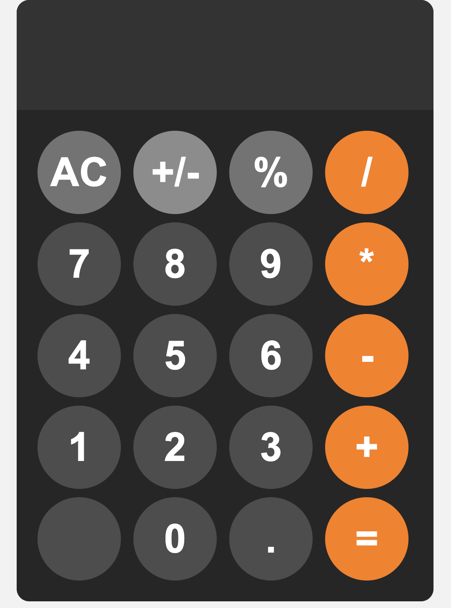

A simple calculator based off the Chrome OS's calculators

You can use floating point values to add, subtract, multiply, divide.
You are not able to see values when they overflow the display.

To add:

click on the plus sign (+) then click on the equal sign (=) to calculate

To subtract:

click on the minus sign (-) then click on the equal sign (=) to calculate

To multiply:

click on the multiply sign (*) then click on the equal sign (=) to calculate

To divide:

click on the divide sign (/) then click on the equal sign (=) to calculate

* You can choose to do multiple operations at the same time

To clear display:

click on the AC button

To make it into a percentage:

click on the % button
* it evaluates the expression first before dividing by 100

To change the sign:

click on the +/- button
* it evaluates the expression first and then swaps the sign of the result

Thank you so much for reading!
